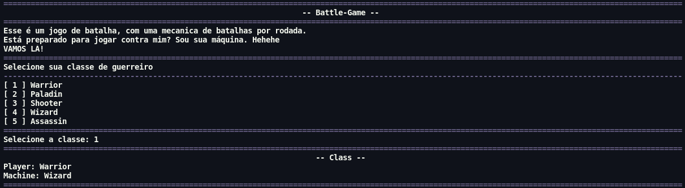
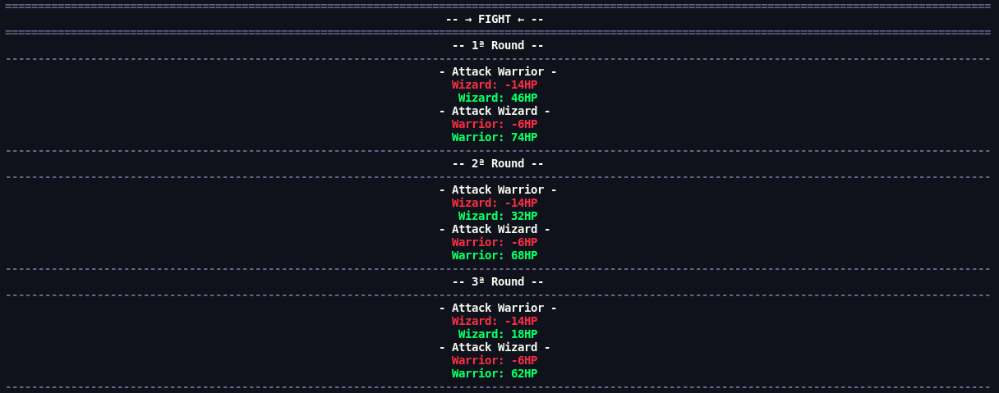

# RPG-Battler

## 🗂 Project description

	A battle RPG, in which you choose your warrior class, and fight your machine. The battle is formed by rounds, and is based on the attributes of each warrior class.
    <h4 align="center">-- Atributos --</h4>

    Warrior = HP80 / ATK26 / DEF20 / VEL22
    Paladin = HP90 / ATK20 / DEF26 / VEL6
    Shooter = HP55 / ATK36 / DEF8 / VEL12
    Wizard = HP60 / ATK26 / DEF12 / VEL16
    Assassin = HP65 / ATK30 / DEF14 / VEL26

 

### 🖼 Image project
<h4>Battle-01</h4>

<h4>Battle-02</h4>

---

### 🛠 Technology

1. Python

---

### ✔ Status

<h4>Building</h4>

<footer align="center" >&copy; NT Developer</footer>